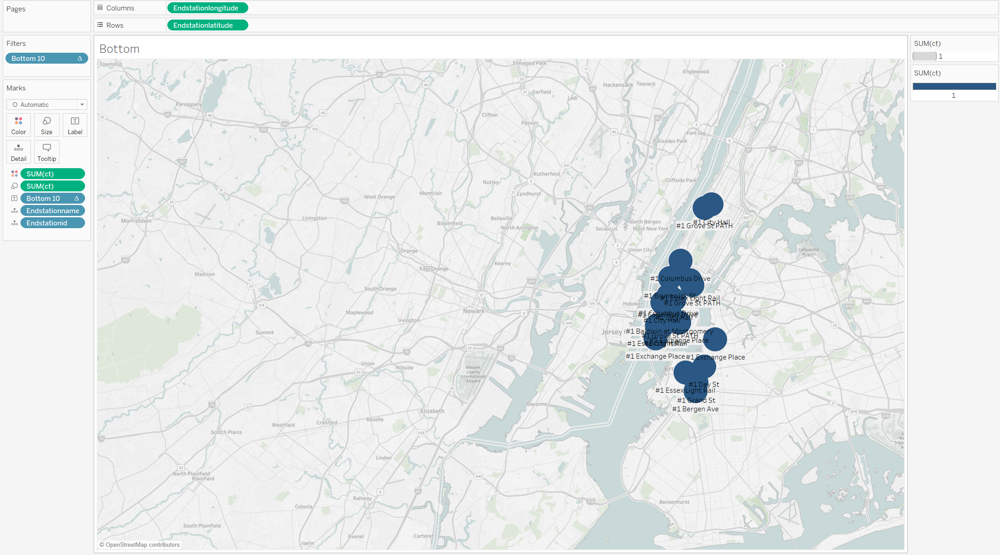

# Citi Bike Analytics

## Background

Congratulations on your new job! As the new lead analyst for the [New York Citi Bike](https://en.wikipedia.org/wiki/Citi_Bike) Program, you are now responsible for overseeing the largest bike sharing program in the United States. In your new role, you will be expected to generate regular reports for city officials looking to publicize and improve the city program.

Since 2013, the Citi Bike Program has implemented a robust infrastructure for collecting data on the program's utilization. Through the team's efforts, each month bike data is collected, organized, and made public on the [Citi Bike Data](https://www.citibikenyc.com/system-data) webpage.

However, while the data has been regularly updated, the team has yet to implement a dashboard or sophisticated reporting process. City officials have a number of questions on the program, so your first task on the job is to build a set of data reports to provide the answers. 

* How many trips have been recorded total during the chosen period? (Jan 2016 - Nov 2018)
    * 851,289 Trips are completed
        * 

* By what percentage has total ridership grown?
    * Total ridership has grown 19.12% from 2016 to 2017 and 4.70% from 2017 to 2018 (without calculating Nov and Dec of 2018)
        * 

* What are the peak hours in which bikes are used during summer months? 
    * June, July and August are considered summer months for analysis and are applied as filters. The trend shows that the busy times are between 6:30 AM - 09:30 AM and 16:30 PM - 20:00 PM. This could be due to more people using bikes for commute. Although there is a bigger population of people using bikes in the evening than in morning hours.
        * 
* What are the peak hours in which bikes are used during winter months?
    * December, January and February are considered winter months for analysis and are applied as filters. The trend is similar to summer months with busy times are between 7:00 AM - 09:30 AM and 16:30 PM - 20:00 PM, although we see a significant dip in the number of people riding the bike overall showing cold weather affects people's ability to ride to work. 
        * 
* Today, what are the top 10 stations in the city for starting a journey? (Based on data, why do you hypothesize these are the top locations?)
    * Top stations for starting are more or less around same stations across the years with slight variations. 
    * Majority of the top 10 stations are near pier/waterways which could point to commuters using waterways and bike as combination for commuting to work/school. Please find below the different maps
        * 
    

* Today, what are the top 10 stations in the city for ending a journey? (Based on data, why?)
    * Top stations for ending journey do vary a bit between the years. 
    * Majority of the top 10 stations are near pier/waterways which could point to commuters using waterways and bike as combination for commuting to work/school. Please find below the different maps
        * 
    

* Today, what are the bottom 10 stations in the city for starting a journey? (Based on data, why?)
    * Bottom 10 stations are outside manhattan and could be because people might be driving to those locations and then taking a public tranist system like waterway or subway to enter Manhattan.
        * 

* Today, what are the bottom 10 stations in the city for ending a journey (Based on data, why?)
    * Same trend follows for endingstations as well. Bottom 10 stations are outside manhattan and could be because people might be driving to those locations and then taking a public tranist system like waterway or subway to enter Manhattan.
        * 

* Today, what is the gender breakdown of active participants (Male v. Female)?
    * There are 613,288 Male riders vs 177,417 female riders. 60,584 riders have not disclosed gender.
        * 

* How effective has gender outreach been in increasing female ridership over the timespan?
    * As we can see, the percentage of female riders has steadily increased in same percentage as male riders although the increase in actual number of riders is much higher for male riders. This shows that the gender outreach has been a sucess
        * 

* How does the average trip duration change by age?
    * We could clearly see that youngsters spend more time riding (16 - 20 years) than others age groups.
    * Rest of the age gropu are almost consistent with intermittent highs at 43, 49 and 80
    * We can also see some outliers with age falliong above 90 which shows age data cannot be relied accurately. 
        * 

* Which bikes (by ID) are most likely due for repair or inspection in the timespan? 
    * Bikes which are used the most are likely due for repair or inspection due to wear and tear from constant use
        * 
    * Coverse could also be true if some bikes are never used, could point to damage
        * 

* How variable is the utilization by bike ID?
    * Its quite varied and no patterns can be obtained as is evident in the graph below
        * 

**Additionally, city officials would like to see the following visualizations:**

* A static map that plots all bike stations with a visual indication of the most popular locations to start and end a journey with zip code data overlaid on top.
    *  

